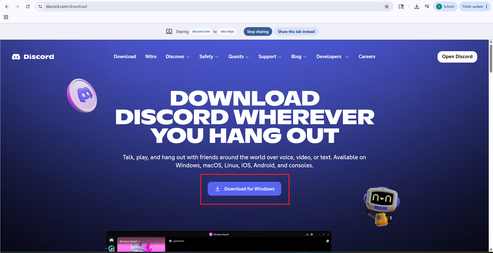

# Installation Guide

[← Back to Home](../README.md)

---

# Overview

This guide explains how to install the software required for the TikTok Remote Streaming System.

The system allows a remote host to appear on a TikTok livestream through Discord while an operator manages the broadcast using TikTok LIVE Studio or OBS Studio.

---

# Required Software

## Hosts

Hosts only need:

* Discord

## Operators

Operators need:

* Discord
* TikTok LIVE Studio

---

# Step 1: Install Discord

## Purpose

Discord is used for:

* Voice communication
* Screen sharing
* Communication between hosts and operators

## Download

[Download Discord](https://discord.com/download)

## Instructions

1. Open the Discord download page.
2. Click **Download for Windows**.
3. Run the installer.
4. Sign in or create a Discord account.

## Screenshot

---

# Step 2: Join the Discord Server

The operator will provide an invitation link.

1. Open Discord.
2. Click the invitation link.
3. Join the server.

---

# Step 3: Install TikTok LIVE Studio

## Purpose

TikTok LIVE Studio is used by the operator to broadcast the livestream.

## Download

[Download TikTok LIVE Studio](https://www.tiktok.com/studio/download)

## Instructions

1. Download TikTok LIVE Studio.
2. Install the application.
3. Sign in using the TikTok account that will be used for streaming.
4. Launch the application.

---

# Step 4: Install OBS Studio (Optional)

## Purpose

OBS Studio provides additional streaming features such as:

* Multiple scenes
* Overlays
* Recording
* Advanced layouts

## Download

[Download OBS Studio](https://obsproject.com/download)

## Instructions

1. Download OBS Studio.
2. Run the installer.
3. Launch OBS Studio.
4. Create a new scene.

---

# Next Step

Continue to the [Host Guide](02-host-guide.md)

Next: [Host Guide](02-host-guide.md)
