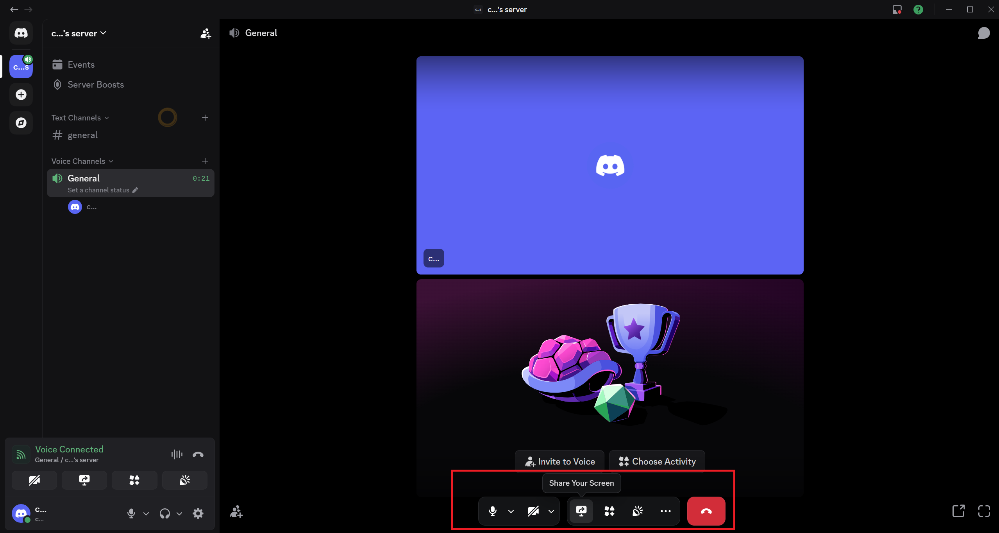

# Host Guide

[← Back to Home](../README.md)

---

# Overview

This guide explains how a remote host joins the livestream.

Hosts do NOT need TikTok LIVE Studio.

Hosts only need Discord.

---

# Step 1: Install Discord

If Discord is not already installed, follow the Installation Guide.

[Installation Guide](01-installation.md)

---

# Step 2: Join the Discord Server

The operator will provide a Discord invite link.

1. Open Discord.
2. Click the invite link.
3. Join the server.

## Success Criteria

* [ ] Joined server
* [ ] Can see channels

---

# Step 3: Join the Voice Channel

Locate the designated voice channel.

Example:

```text
Live Hosts
```

Click the voice channel to join.

### Screenshot Needed

Save as:

```text
images/annotated/06-join-voice-channel.png
```

## Success Criteria

* [ ] Connected to voice channel
* [ ] Can hear operator

---

# Step 4: Verify Audio

Turn on your microphone.

Speak to the operator.

The operator should be able to hear you.

## Success Criteria

* [ ] Microphone active
* [ ] Operator can hear host

---

# Step 5: Share Your Screen

Click the Share Screen button.



Select:

* Entire Screen
  or
* Specific Application

Press Start Streaming.

## Success Criteria

* [ ] Screen visible
* [ ] Stream started

---

# Step 6: Verify Screen Share

The operator should confirm:

* Screen visible
* Audio working
* Stream quality acceptable

### Screenshot Needed

Save as:

```text
images/annotated/07-host-screen-visible.png
```

---

# Step 7: Read Viewer Chat

The operator will share the TikTok chat window back through Discord.

Read comments from viewers.

Respond verbally during the livestream.

Hosts do not need to type into TikTok chat.

### Screenshot Needed

Save as:

```text
images/annotated/08-chat-window-shared.png
```

---

# Before Going Live

Verify:

* [ ] Joined Discord
* [ ] Joined voice channel
* [ ] Microphone working
* [ ] Screen sharing active
* [ ] Can see operator
* [ ] Can read chat

---

# Common Problems

## Nobody Can Hear Me

Check:

* Microphone selected
* Discord permissions granted
* Microphone not muted

## Nobody Can See My Screen

Check:

* Share Screen active
* Correct monitor selected

## I Cannot Read Chat

Ask the operator to share the TikTok chat window.
