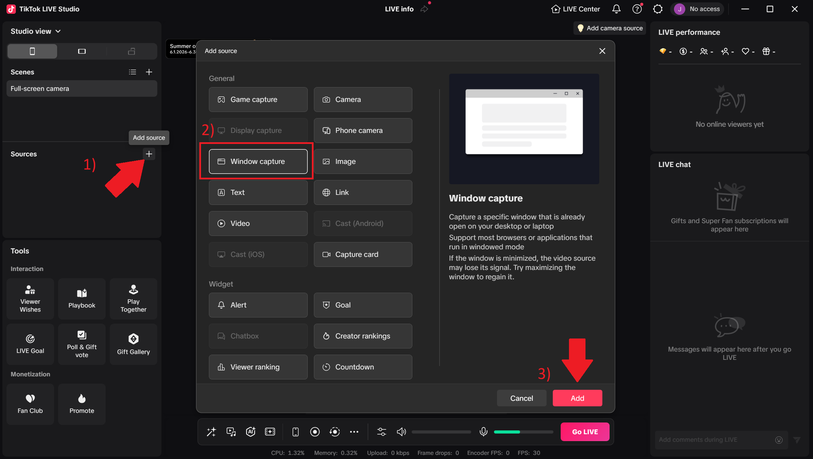
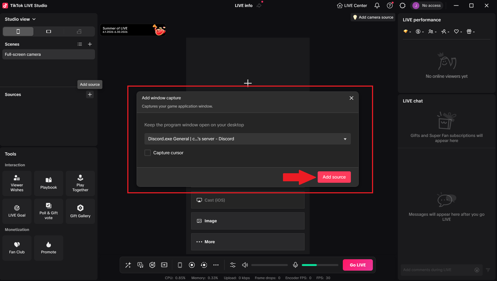
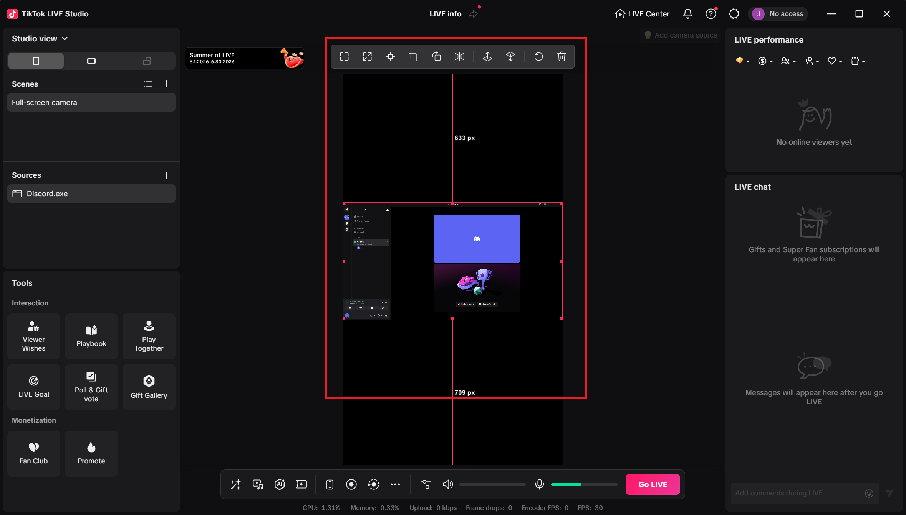

# Operator Guide

[← Back to Home](../README.md)

---
# Overview

The operator is responsible for receiving the host's Discord stream and broadcasting it to TikTok.

In this guide, you will:

- Open TikTok LIVE Studio
- Add the Discord stream as a source
- Verify the host appears in the preview window
- Prepare the livestream for broadcasting

By the end of this guide, the host's screen should be visible inside TikTok LIVE Studio and ready to go live.

# Step 1

Open TikTok LIVE Studio.

---

# Step 2

Press Add Source.

Select Window Capture.

Press Add.

---

# Step 3

Choose the Discord window.

Press Add Source.

---

# Step 4

Verify the preview appears.

---

# Next Step

Continue to the [Chat Guide](04-chat-guide.md)
